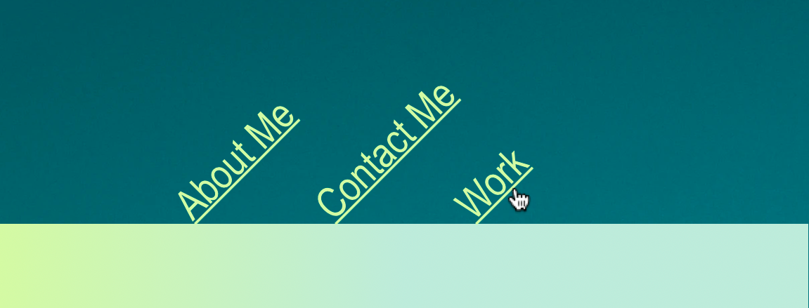
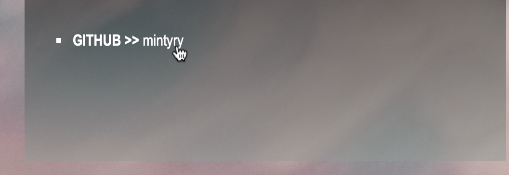
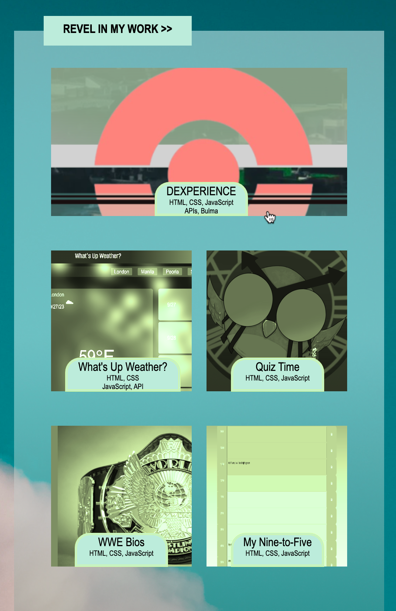

# Minty-Ry-Portfolio

## Description

This is a portfolio of my work for future employers and those interested in what I've done.

Other than being a required assignment, my motivation for this was to build a an eye-catching and comprehensive portfolio for prospective employers. At this point, we have wrapped up CSS, and I wanted to exhibit some of my creativity to the best of my ability with the required specifications.

This application not only displays my work and a bit about myself, but it solves a few problems: links will jump to their corresponding sections, and images of my deployed apps are linked so that visitors may click and subsequently view the respective apps. Additionally, my app demonstrates solutions for when others view it under different resolutions/screen sizes by being responsive and adjusting its layout in various manners.

In building this application, I learned that CSS can truly be used in a variety of ways to exexute one's ideas/goals. There are many approaches one can use to achieve the same effect, but properties and values will vary depending on other present elements and how they all work within the layout with each other. This can be tricky, but also encourages me to be creative and think... out of the box (pun intended, absolutely.)

## Installation

N/A

## Usage

For this application, you can use the navigation links at the top to visit its corresponding section. Simply click one of the three links and voila! You are at its respective section.

All three sections provide information about me! The About Me section provides some quick tidbits about -- you guessed it -- me. You can visit the contact section to find out how you can reach out to me. You can also view the work section to revel in my work.

In the contact section, you can click on the email address, Instagram name, or GitHub name to email me or visit those social pages, respectively.

In the work section, you can click on any of the app screenshots to visit other works I've deployed!

## Credits

N/A

## Project Repository

Please enjoy the [deployed application here](https://mintyry.github.io/Minty-Ry-Portfolio/)!